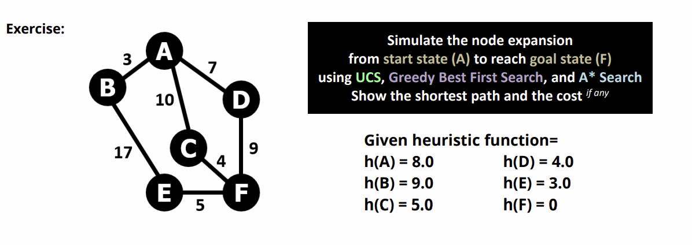

# Soal QUIZ LB20

### SOAL 1

<figure><figcaption></figcaption></figure>

Click to Reveal Answer

.png>).png>)

### SOAL 2

<figure><figcaption></figcaption></figure>

Click to Reveal Answer

### SOAL 3

<figure><figcaption></figcaption></figure>

Click to Reveal Answer

.png>)

### SOAL 4

<figure><figcaption></figcaption></figure>

Click to Reveal Answer

.png>)

